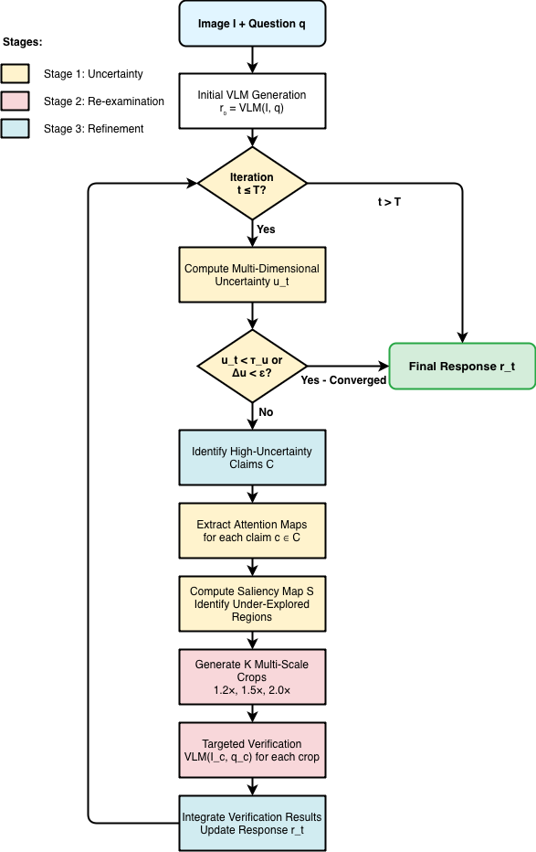
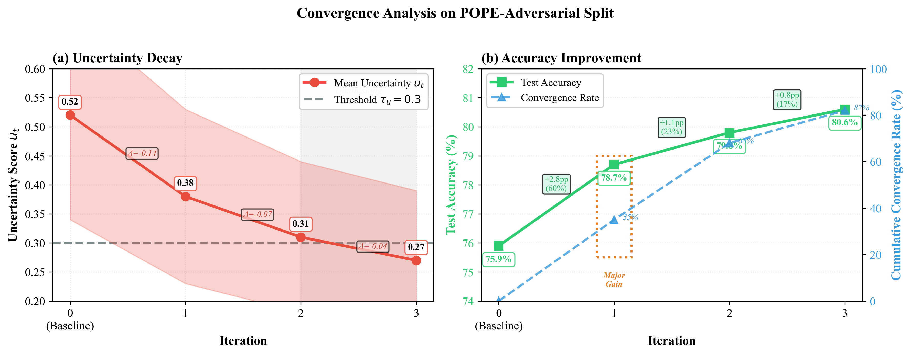

# Self-Correcting Vision-Language Models via Uncertainty-Guided Visual Re-Attention

A training-free framework for reducing hallucinations in Vision-Language Models (VLMs) through iterative uncertainty-guided visual re-examination.

## Overview

This repository implements a self-correction system that enables VLMs to identify and fix their own hallucinations without requiring additional training or external models. The approach combines multi-dimensional uncertainty quantification with attention-guided cropping to systematically re-examine under-explored image regions.



## Key Features

- **Training-Free**: Works with frozen, pretrained VLMs (no gradient updates required)
- **Multi-Dimensional Uncertainty**: Combines token entropy, attention dispersion, semantic consistency, and linguistic confidence
- **Attention-Guided Re-examination**: Automatically identifies and crops under-explored image regions
- **Iterative Refinement**: Progressively improves response quality through targeted verification

## Results

On POPE-Adversarial benchmark using Qwen2.5-VL-7B:

- **+4.7 percentage points** improvement in object existence accuracy
- **-9.8 percentage points** reduction in hallucination rate
- **48.1%** decrease in uncertainty scores after 3 iterations



## Installation

```bash
# Clone the repository
git clone https://github.com/kassoumsanogo1/self-correcting-vlm-re-Attention.git
cd self-correcting-vlm-re-Attention

# Create virtual environment
python -m venv .venv
source .venv/bin/activate  # On Windows: .venv\Scripts\activate

# Install dependencies
pip install torch torchvision transformers pillow numpy matplotlib
```

## Quick Start

```python
from utils.selfrefinementengine import SelfRefinementEngine
from PIL import Image
import torch

# Initialize the refinement engine
engine = SelfRefinementEngine(
    model_name="Qwen/Qwen2-VL-7B-Instruct",
    device="cuda" if torch.cuda.is_available() else "cpu"
)

# Load your image
image = Image.open("path/to/your/image.jpg")
question = "What objects are visible in this image?"

# Run self-correction
result = engine.refine_response(
    image=image,
    question=question,
    max_iterations=3,
    verbose=True
)

print(f"Final Response: {result.final_response}")
print(f"Uncertainty: {result.final_uncertainty:.3f}")
```

## Project Structure

```
.
├── main.py                          # Main entry point and example usage
├── graph_convergence.py             # Convergence analysis visualization
├── utils/
│   ├── selfrefinementengine.py     # Core self-refinement implementation
│   ├── uncertaintymetrics.py       # Uncertainty quantification methods
│   └── visualreattention.py        # Attention-guided cropping
├── figures/                         # Generated visualizations
└── main.tex                         # Research paper (LaTeX)
```

## Method

Our framework operates in three stages:

1. **Uncertainty Quantification**: Compute multi-dimensional uncertainty scores combining:

   - Token-level entropy
   - Attention dispersion
   - Semantic consistency (via multiple sampling)
   - Linguistic confidence markers

2. **Attention-Guided Re-examination**: For high-uncertainty claims:

   - Extract attention maps to identify under-explored regions
   - Generate multi-scale crops (1.2×, 1.5×, 2.0×)
   - Formulate targeted verification questions

3. **Iterative Refinement**: Integrate verification results and update the response until convergence or maximum iterations

## Citation

If you use this work in your research, please cite:

```bibtex
@article{sanogo2025selfcorrecting,
  title={Towards Self-Correcting Vision-Language Models via Uncertainty-Guided Visual Re-Attention},
  author={Sanogo, Kassoum and Ardiccioni, Renzo},
  journal={arXiv preprint},
  year={2025},
  institution={ESEO Engineering School and Le Mans Université}
}
```

## Authors

- **Kassoum Sanogo** - ESEO Engineering School, Angers, France
- **Renzo Ardiccioni, PhD** - Le Mans Université, Le Mans, France

## License

This project is licensed under the MIT License - see the [LICENSE](LICENSE) file for details.

## Acknowledgments

This work builds upon the Qwen2.5-VL architecture and leverages insights from recent research on hallucination mitigation in vision-language models.

## Contact

For questions or collaboration opportunities:

- Email: kassoum_sanogo@reseau.eseo.fr
- GitHub: [@kassoumsanogo1](https://github.com/kassoumsanogo1)
